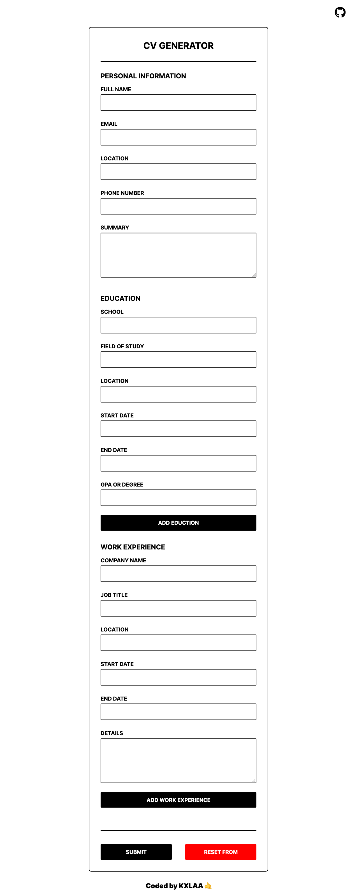
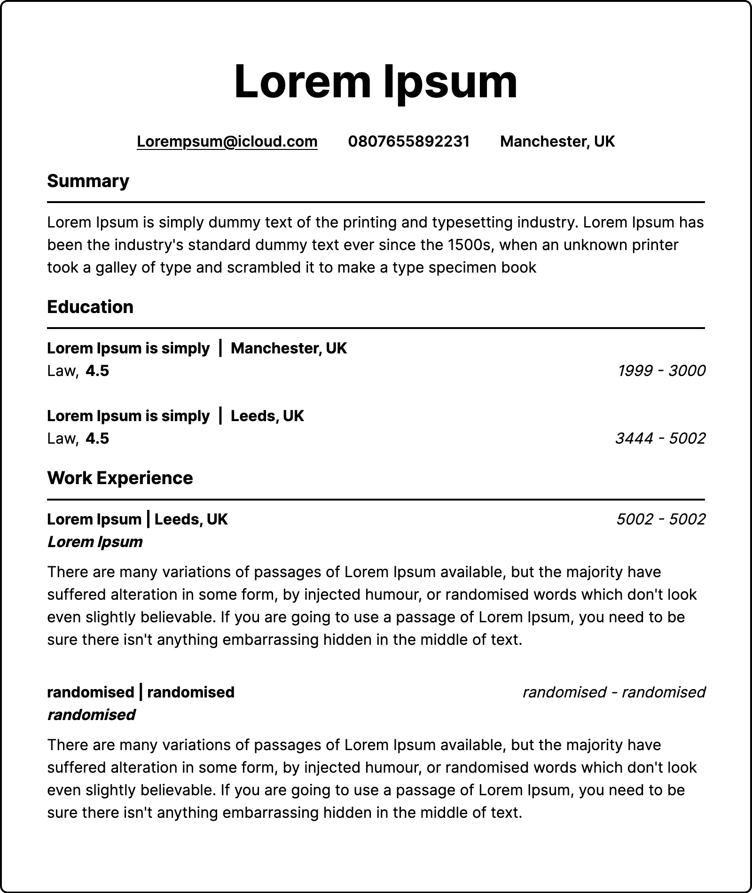

# CV APP

Generate a CV with this handy website made in React. Input state is managed with the `useState` hook and routing is done using **react router**.

The completed CV is styled using **Styled Components**

## Demo
### Form

### Output CV

Ypu can view the site live here: [CV GENERATOR](https://cv-generator-react-01.netlify.app/)

or you can run it locally:

In the project directory, you can run:

### `npm install`
To install all node modules locally

### `npm start`
Runs the app in the development mode.\
Open [http://localhost:3000](http://localhost:3000) to view it in the browser.

